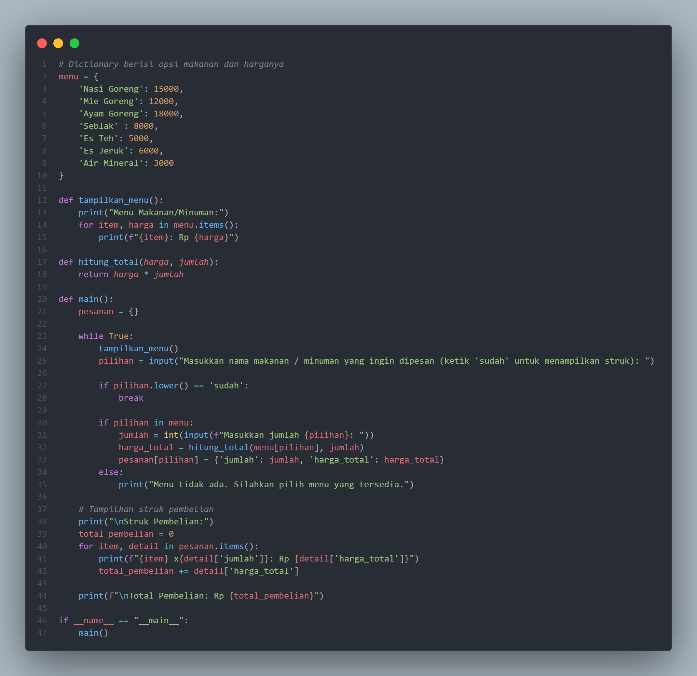
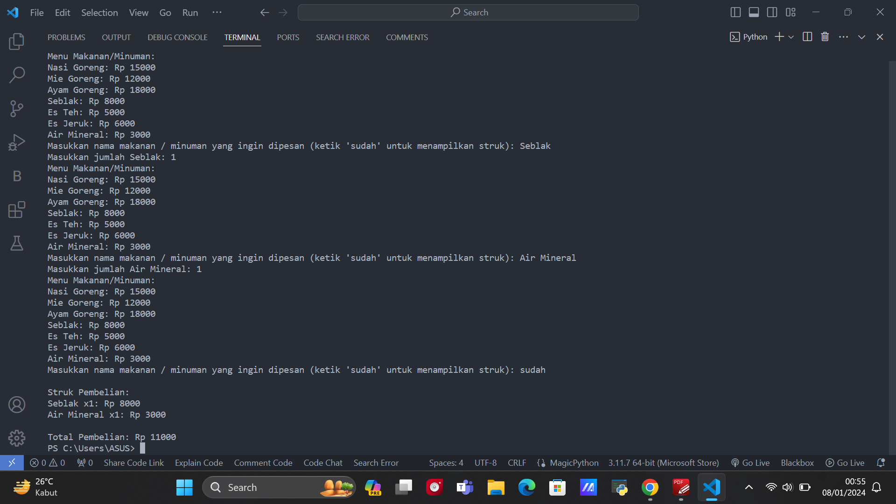

# Project_UAS

| NAMA  :| FADIL ADITYA ADZIMA |
| --- | --- |
| NIM   :| 312310617 |
| KELAS :| TI.23.A.6 |
| DOSEN :| Agung Nugroho,S.Kom.,M.Kom |

<Hr>

# Tugas Project Ujian Akhir Semester

## **Program Kasir Di Sebuah Kantin**<br>

|Link Youtube| https://youtu.be/sBzT8UeMFJw?feature=shared |
| --- | --- |

# $${\color{lightblue}CODE.PROGRAM.PYTHON}$$


# HASIL DARI CODE PROGRAM 


# $${\color{lightblue}PENJELASAN}$$

1. Dictionary Menu (menu):
Pada bagian awal program, terdapat sebuah dictionary yang menyimpan opsi pilihan makanan/minuman beserta harganya. Setiap item dalam dictionary berisi nama makanan/minuman sebagai kunci (key) dan harga sebagai nilai (value).
```python
menu = {
    'Nasi Goreng': 15000,
    'Mie Goreng': 12000,
    'Ayam Goreng': 18000,
    'Seblak' : 8000,
    'Es Teh': 5000,
    'Es Jeruk': 6000,
    'Air Mineral': 3000
```

2. Fungsi tampilkan_menu():
Fungsi ini digunakan untuk menampilkan opsi makanan/minuman beserta harganya kepada pengguna. Fungsi ini menggunakan loop untuk mencetak setiap item dalam dictionary menu.
```python
def tampilkan_menu():
    print("Menu Makanan/Minuman:")
    for item, harga in menu.items():
        print(f"{item}: Rp {harga}")
```

3.Fungsi hitung_total(harga, jumlah):
Fungsi ini menerima dua parameter, yaitu harga dan jumlah makanan/minuman yang dipesan, lalu menghitung total harga pesanan.
```python
def hitung_total(harga, jumlah):
    return harga * jumlah
```

4. Fungsi main():
Fungsi utama program yang berisi logika utama. Program ini menggunakan loop while untuk terus menerima input pengguna hingga pengguna memilih untuk keluar (dengan mengetik "sudah").
Setiap kali pengguna memilih makanan/minuman, program meminta jumlah pesanan dan menghitung total harga pesanan menggunakan fungsi hitung_total. Informasi pesanan disimpan dalam dictionary pesanan.
Setelah pengguna selesai memilih, program menampilkan struk pembelian berisi rincian setiap pesanan dan total pembelian.
```python
def main():
    pesanan = {}

    while True:
        tampilkan_menu()
        pilihan = input("Masukkan nama makanan / minuman yang ingin dipesan (ketik 'sudah' untuk menampilkan struk): ")

        if pilihan.lower() == 'sudah':
            break

        if pilihan in menu:
            jumlah = int(input(f"Masukkan jumlah {pilihan}: "))
            harga_total = hitung_total(menu[pilihan], jumlah)
            pesanan[pilihan] = {'jumlah': jumlah, 'harga_total': harga_total}
        else:
            print("Menu tidak ada. Silahkan pilih menu yang tersedia.")

    # Tampilkan struk pembelian
    print("\nStruk Pembelian:")
    total_pembelian = 0
    for item, detail in pesanan.items():
        print(f"{item} x{detail['jumlah']}: Rp {detail['harga_total']}")
        total_pembelian += detail['harga_total']

    print(f"\nTotal Pembelian: Rp {total_pembelian}")
```

5. Panggilan Fungsi Utama (if __name__ == "__main__":):
Baris ini memastikan bahwa fungsi main() akan dijalankan ketika program dieksekusi.
```python
if __name__ == "__main__":
    main()
```
